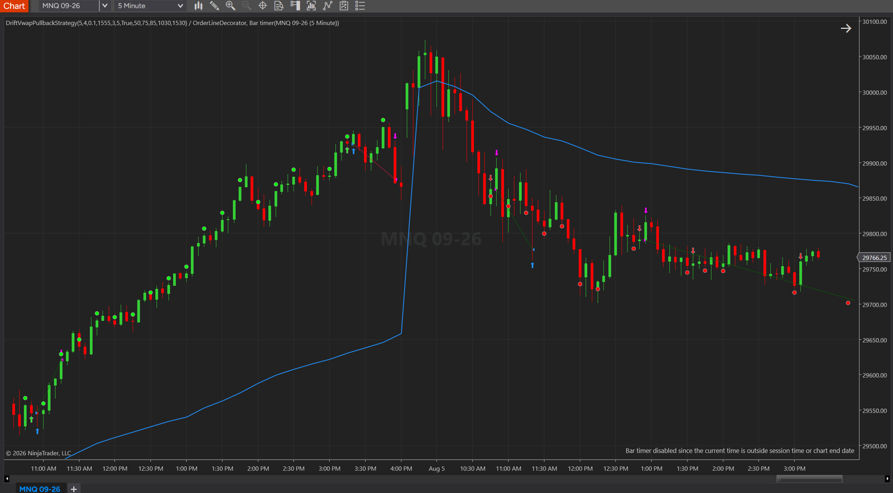

<h1 align="center">DriftVwapPullback</h1>

  <b>A faithful replication of the "Drift VWAP Pullback" strategy for NQ futures, built twice from one closed spec.</b> 
  A NinjaTrader 8 strategy and a PropSim plugin implement the identical rules, and a fidelity
  gate must show they trade identically before either side's backtest number is believed.

  <a href="#what-it-is">What it is</a> ·
  <a href="#what-the-source-claims">The claim</a> ·
  <a href="#how-it-trades">How it trades</a> ·
  <a href="#status-and-limits">Status and limits</a> ·
  <a href="#read-next">Read next</a>

  
  
  
  
  

---

## What it is

A replication study, not a product. The strategy was described on camera by Matteo Conti
(seven years a market maker at Nordea Markets, CIO at SQR Capital) in
[this interview](https://www.youtube.com/watch?v=wm4A6qo0g3I). No code was published.

The goal is to transcribe his rules exactly, implement them twice from one closed spec, and
find out what they do on a tape he did not fit them to.

Faithful means faithful. Where the description is visibly suboptimal — the take profit is
40 points long and 50 points short, with no stated reason for the asymmetry — the spec keeps
it and records the suspicion. A corrected replication is a test of a different strategy.

## What the source claims

His figures, from his 2020–2024 development window plus his own out-of-sample run to
August 2026, over **more than 4,000 trades**. They are his measurements, not ours:

| | |
|---|---|
| Win rate | 64–65 % |
| Average win | $866 (43.3 points, 1 NQ) |
| Average loss | $1,300 (65.0 points, 1 NQ) |

He states plainly that the strategy is unlikely to make money on private capital, and
presents it instead as a way to maximise the probability of passing a prop-firm challenge.

Those three numbers imply a **profit factor of 1.18**, an expectancy of **$86 per trade**,
and a **breakeven win rate of 60.0 %**. The entire edge is four percentage points of win
rate. Whether an independent measurement agrees is the question this repository exists to
answer.

## How it trades

Two series on NQ: a 15-minute regime series and a 5-minute execution series, RTH only.

A session VWAP anchored at 09:30 ET defines the day's drift. The drift is **long** when the
15-minute close is above the VWAP, the VWAP is rising, and NQ has gained at least 0.10 % over
the past hour — and **short** on the mirror conditions. Once a drift establishes, the first
counter-direction 5-minute candle is the trigger, and entry is a market order at the next
bar's open. The pullback does not have to reach the VWAP.

Exits are a fixed 80-point stop against a 40-point target long, 50 short, plus a flatten at
15:55 ET. No entries before 10:30 or after 15:30.

The premise is that VWAP is not a mean-reversion magnet but a place where institutional
execution imbalance becomes visible — so the trade is continuation, not reversion.

## Status and limits

**Nothing is built and nothing is validated.** This repository currently contains one thing:
a closed design spec. No code, no backtest, no result.

What is already known before the first line is written:

- The source's own reported figures **fail two of this project's acceptance gates** — a
  profit factor of 1.18 against a required 1.30, and an expectancy of 0.066R against a
  required 0.10R.
- The 80-point stop is $1,600 on 1 NQ, which exceeds the daily loss limit of a typical
  50K evaluation account. The size the source quotes belongs to a larger account.
- This is the fifth strategy of the "pullback in a trend" family tested in this workspace.
  The four before it were negative.

None of that is a verdict. It is the reason the study is worth running rather than assumed.

## Read next

[`docs/specs/2026-08-07-driftvwap-design.md`](docs/specs/2026-08-07-driftvwap-design.md) —
the closed spec: normative rules, the closed parameter list, every ambiguity in the source
with the reading that was frozen and why, and the pre-registered list of what the first run
measures.

## License

MIT. Nothing here is financial advice.
