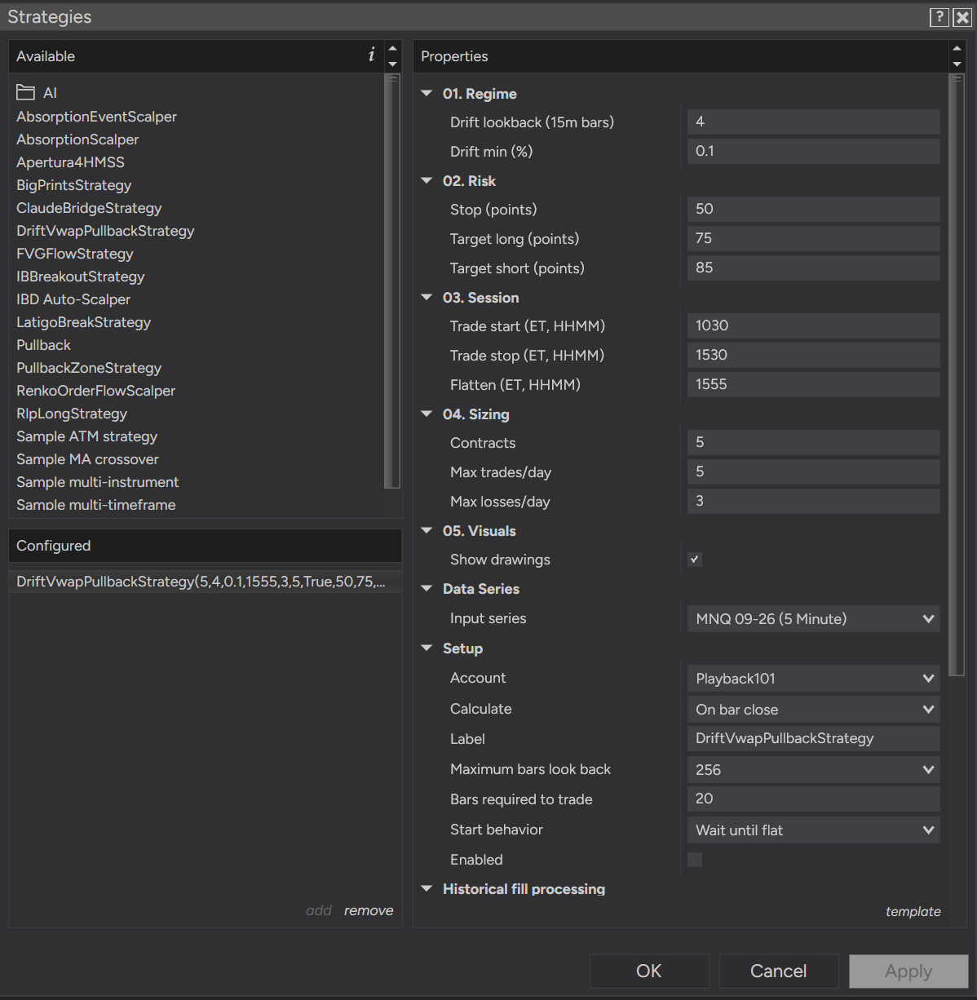
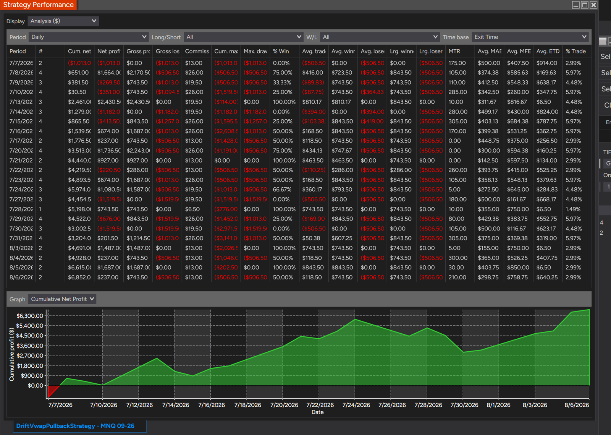
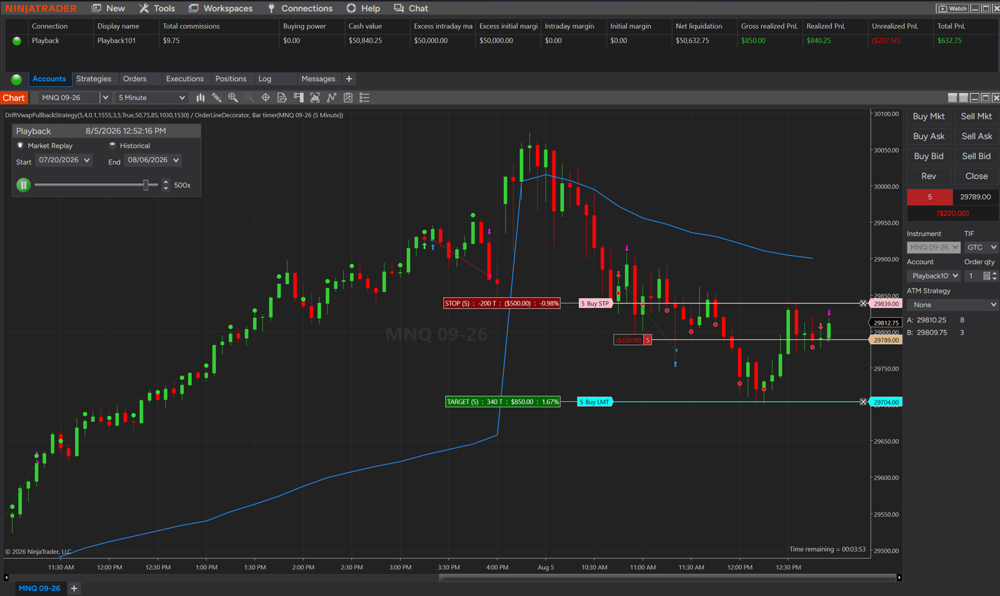

<h1 align="center">DriftVwapPullback</h1>

  <b>A faithful replication of the "Drift VWAP Pullback" strategy for NQ/MNQ futures, built twice from one closed spec.</b> 
  A NinjaTrader 8 strategy and a PropSim plugin implement the identical rules, and a fidelity
  gate must show they trade identically before either side's backtest number is believed.

  <a href="#what-it-is">What it is</a> ·
  <a href="#recommended-setup-mnq">Recommended setup</a> ·
  <a href="#how-it-trades">How it trades</a> ·
  <a href="#the-mirror-gate">The mirror gate</a> ·
  <a href="#status-and-limits">Status and limits</a>

  
  
  
  
  

---

## What it is

A replication study, not a product. The strategy was described on camera by Matteo Conti
(seven years a market maker at Nordea Markets, CIO at SQR Capital) in
[this interview](https://www.youtube.com/watch?v=wm4A6qo0g3I). No code was published.

The goal is to transcribe his rules exactly, implement them twice from one closed spec, and
find out what they do on data he did not fit them to. The two implementations —
`ninjascript/DriftVwapPullbackStrategy.cs` and `propsim/drift_vwap_pullback.py` — are compared
trade for trade by `research/compare_mirror.py`, and **no performance number from either side
is trusted until that comparison passes**.

Faithful means faithful. Where the description is visibly suboptimal — the transcribed take
profit is 40 points long and 50 short against an 80-point stop, a reward:risk below 1 with no
stated reason for the asymmetry — the spec keeps it and records the suspicion, because a
"corrected" replication is a test of a different strategy.

## Recommended setup (MNQ)

**The author's own recommendation: run this on MNQ, not NQ.** That is where the testing has been
done, and the smaller contract makes the position sizing below practical on a normal account.

| Parameter | Value |
|---|---|
| Instrument / series | MNQ, 5-minute |
| Drift lookback | 4 (15m bars) |
| Drift min | 0.1 % |
| **Stop** | **50 points** |
| **Target long** | **75 points** |
| **Target short** | **85 points** |
| Trade start / stop | 10:30 / 15:30 ET |
| Flatten | 15:55 ET |
| Contracts | 5 |
| Max trades / day | 5 |
| Max losses / day | 3 |
| Session template | `US Equities RTH` |
| Calculate | On bar close |

**Read the three bold rows before using this.** They are not the spec's defaults, and the
difference is not cosmetic: the transcribed strategy risks 80 points to make 40–50, while this
configuration risks 50 to make 75–85. **The reward:risk is inverted.** Conti's version needs a
high win rate to survive — his own reported 64 % sits barely above its 60 % breakeven. This one
does not; it wins less often and wins bigger. It is a different animal wearing the same entry
logic, and it should be judged on its own evidence rather than on his.

 

### What that configuration produced

NinjaTrader Market Replay on MNQ 09-26, **7 July – 6 August 2026, 23 sessions, 67 trades**, at
the configuration above. Read directly off the report: **cumulative net $6,852.00**, total
commissions $435.50, average winner in the $743–$843 band, average loser $506.50 — which is the
50-point stop plus costs, exactly as designed.

Derived from those figures, not read off the report: roughly **$102 per trade** (about 10 points
at 5 MNQ), a win rate near **47 %**, and a profit factor near **1.38**.

**How much this is worth, stated plainly.** It is Market Replay, not live. It is 67 trades, below
this project's own 100-trade minimum for taking any metric seriously. It is one contract month
in one month of one regime. And it has **not** passed the mirror gate, so it is a number from one
of the two implementations rather than a number about the strategy. It is genuinely encouraging
and it is not evidence yet.

## How it trades

Two series on NQ or MNQ: a 15-minute regime series and a 5-minute execution series, RTH only.

A session VWAP anchored at 09:30 ET defines the day's drift. The drift is **long** when the
15-minute close is above the VWAP, the VWAP is rising, and price has gained at least 0.10 % over
the past hour — and **short** on the mirror conditions. Once a drift establishes, the first
counter-direction 5-minute candle is the trigger, and entry is a market order at the next bar's
open. The pullback does not have to reach the VWAP. Re-arming requires the three conditions to
break and return, so an uninterrupted drift produces exactly one trade.

Exits are a fixed stop against a fixed target, plus a flatten before the close. No entries before
10:30 or after 15:30 ET.

The premise is that VWAP is not a mean-reversion magnet but a place where institutional execution
imbalance becomes visible — so the trade is continuation, not reversion.

### Trade management

Three controls exist in NinjaTrader only. The PropSim plugin implements none of them, so each is
**off at its default** and a default run stays comparable to a default plugin dump. Turn any of
them on and the strategy says so in the log at startup.

| Control | Default | What it does |
|---|---|---|
| Draggable stop and target | always on | The bracket is a pair of live-until-cancelled exit orders, priced off the actual fill and never re-asserted. Drag either one in Chart Trader and it **stays** where you put it — the strategy adopts the new price instead of fighting it. |
| Breakeven | off, at 75 % | Once price covers 75 % of the entry→target run, the stop moves to entry ± an offset, once. It measures against the *live* target, so dragging the target further out moves the trigger with it. |
| Daily profit / loss limit | off (0 / 0) | Dollar limits on the day. On a breach the strategy flattens and takes no further entries until the next session. |

The daily limits watch the **whole account** by default: every robot trading that account counts
toward them, whether or not this strategy took the trade. They measure from the 09:30 RTH open, so
P&L another strategy booked overnight does not count. Switch the checkbox off to measure this
strategy's own P&L alone. A Strategy Analyzer run always falls back to own-P&L — a backtest has no
meaningful account-wide figure to read, and the fallback also stops a live chart's breach from
truncating a mirror-gate run.

Why the bracket had to change shape: NinjaTrader re-asserts the prices of `SetStopLoss` and
`SetProfitTarget` orders, which is exactly what used to snap a hand-dragged stop back — and while
one of those is active, the managed approach **ignores** `Exit*` orders outright. The two
mechanisms cannot coexist, so the `Set*` pair was removed rather than supplemented.

## The mirror gate

`research/compare_mirror.py` joins the two implementations' trade lists on entry timestamp —
**exactly, with no tolerance** — and requires identical direction, identical exit reason, and
prices agreeing within one tick. Zero unmatched, zero mismatched, or it fails.

Its first real run failed, which is what a working gate does when two things disagree. Both
causes turned out to be fill-model rather than logic, and both are now understood:

- **Slippage.** PropSim charges two ticks each way by construction; NinjaTrader fills at the real
  price. With slippage zeroed, entry prices match to the cent. The mirror runs at zero slippage
  because it compares *decisions*; the measurement run keeps realistic costs.
- **Fill resolution.** NinjaTrader was resolving intrabar order of stop versus target from
  5-minute bars while PropSim walks real ticks. With an 80/40 bracket, both levels inside one bar
  is common enough to matter.

Run the comparison from the **Strategy Analyzer**, not Playback. Playback stamps roughly a fifth
of its executions at the real fill instant rather than the bar's timestamp, and those can never
join an exact comparison; the Analyzer processes everything historically and aligns cleanly.

## Status and limits

**Nothing here is validated.** Both implementations exist and are reviewed, the strategy trades,
and the instrument that would decide whether they are the same strategy has been built and has
not yet returned a pass.

What is known before that answer arrives:

- The source's own reported figures **fail two of this project's acceptance gates** — a profit
  factor of 1.18 against a required 1.30, and an expectancy of 0.066R against a required 0.10R.
  His entire edge is four percentage points of win rate above breakeven.
- On PropSim's tick tape at the spec's defaults, results swung from **+$169 per trade on one
  contract month to −$160 on another**. The trade frequency, however, matched his closely: 3.15
  per session against his reported ~3.2.
- The 80-point stop of the transcribed configuration is $1,600 on one NQ contract, which exceeds
  the daily loss limit of a typical 50K evaluation account.

None of that is a verdict. It is the reason the study is worth running rather than assumed.

## Read next

- [`docs/specs/2026-08-07-driftvwap-design.md`](docs/specs/2026-08-07-driftvwap-design.md) — the
  closed spec: normative rules, the closed parameter list, every ambiguity in the source with the
  reading that was frozen and why.
- [`docs/plans/2026-08-08-driftvwap-v1.md`](docs/plans/2026-08-08-driftvwap-v1.md) — the
  implementation plan and the pre-registered list of what the first measurement run reports.

## License

MIT. Nothing here is financial advice.
